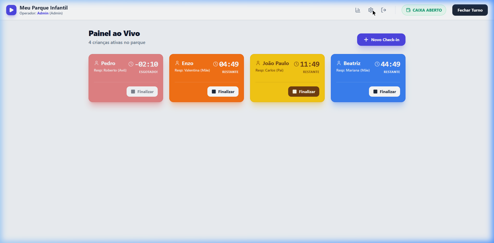
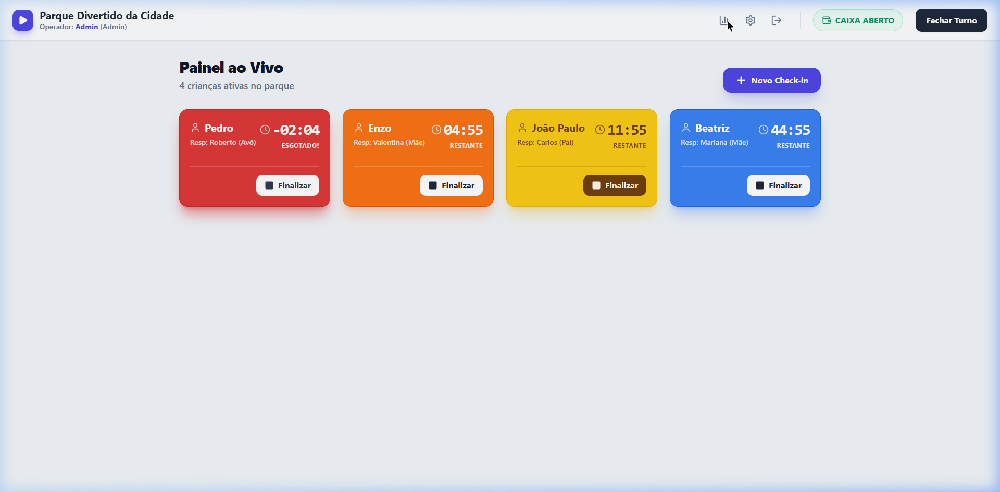
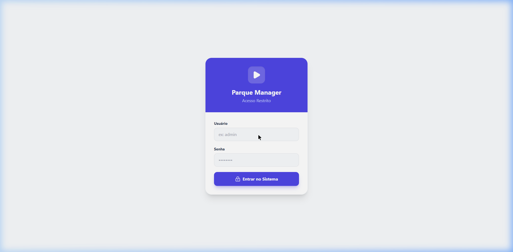
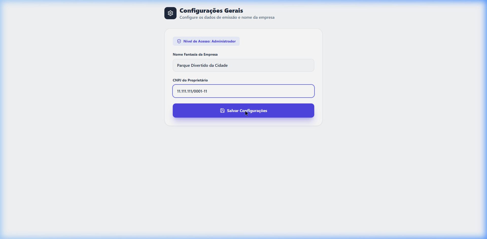

<div align="center">
  <div style="background-color: #4f46e5; display: inline-block; padding: 15px; border-radius: 20px; margin-bottom: 20px;">
    <h1 align="center" style="color: white; margin: 0;">🎡 Parque Manager PRO</h1>
  </div>
  <p align="center">
    <strong>Sistema Proprietário de Gestão em Tempo Real para Parques Infantis e Espaços Kids</strong>
  </p>
  <p align="center">
    
    
    
    
  </p>
</div>

---

## 📖 Sobre o Projeto
O **Parque Manager PRO** é um sistema comercial fechado, comercializado no modelo de assinatura mensal (SaaS), desenvolvido para suprir as dores comerciais de gestão de tempo, controle financeiro (fechamento de fluxo de caixa) e segurança no monitoramento de crianças em shoppings, boliches e parques isolados. 

O sistema conta com Cronômetros Inteligentes que mudam de cor conforme o esgotamento do tempo contratado, além de Controle de Acesso Restrito Baseado em Função (RBAC) via JWT para Operadores de Caixa e Administradores Globais.

---

## 📸 Screenshots (Preview do Sistema)

### 1. Painel Dinâmico e Tempos (Dashboard)
Painel interativo renderizado nativamente em CSS/React e orquestrado por lógicas internas de refetching. Note a prioridade visual que os cards "vencidos" (vermelhos pululantes) adquirem em primeiro lugar:


### 2. Painel Gerencial & Faturamento
Os Administradores possuem visualização exclusiva sobre estatísticas diárias e mensais.


### 3. Autenticação JWT


### 4. Configurações Dinâmicas (Customização)
Alterações de `CNPJ` e `Nome da Empresa` fluem instantaneamente do Backend para toda a árvore do Frontend.


---

## 🛠 Arquitetura e Tecnologias
Este projeto adota uma arquitetura Cliente-Servidor (Monorepo).

**Backend (`/parque_infantil_backend`)**:
- ⚡ **Framework:** FastAPI Python
- 🗄️ **Banco de Dados:** SQLite integrado pelo `SQLAlchemy` (ORM).
- 🔒 **Segurança:** `passlib` com *Bcrypt* para Hashing de senhas, `python-jose` para emissão e quebra de Tokens OAuth2(Bearer JWT).
- **Esquemas:** Totalmente modelado por `Pydantic`.

**Frontend (`/parque_infantil_frontend`)**:
- ⚛️ **Biblioteca de UI:** React com TypeScript
- 🎨 **Estilização Modulada:** Tailwind CSS V3 (Utility-first) e `lucide-react`.
- 🌐 **Navegação (SPA):** `react-router-dom` com contexto local guardando Tokens em LocalStorage / Memory.

---

## 🚀 Instalação e Execução (Dev)

### Pré-requisitos
> Python `3.10+` e Node.JS `18+` instalados!

### Iniciando o Servidor de Banco (Backend)
1. Abra um terminal na pasta backend (`cd parque_infantil_backend`).
2. Instale as bibliotecas seguras: `pip install -r requirements.txt`. (Dependendo, certifique-se que as "Scripts" globais estão ativadas apontando para `uvicorn`).
3. Rode o servidor de API:
   ```bash
   python -m uvicorn main:app --reload
   # ou uvicorn main:app --reload
   ```

### Iniciando o Cliente Visual (Frontend)
1. Mantenha o terminal do backend operando em uma aba e abra outro terminal em `/parque_infantil_frontend`.
2. Baixe os pacotes React e Roteadores: `npm install`.
3. Ligue o ambiente Vite:
   ```bash
   npm run dev
   ```

A aplicação automaticamente subirá em `http://localhost:5173/`. 
> ℹ **DICA:** Você pode acessar imediatamente com as credenciais administrativas geradas automaticamente pelo Seed interno do Python: **admin** e **admin123**.

---
© 2026 Parque Manager PRO. Desenvolvido por Data Power Labs. Todos os direitos reservados. Software proprietário e licenciado sob assinatura mensal.
